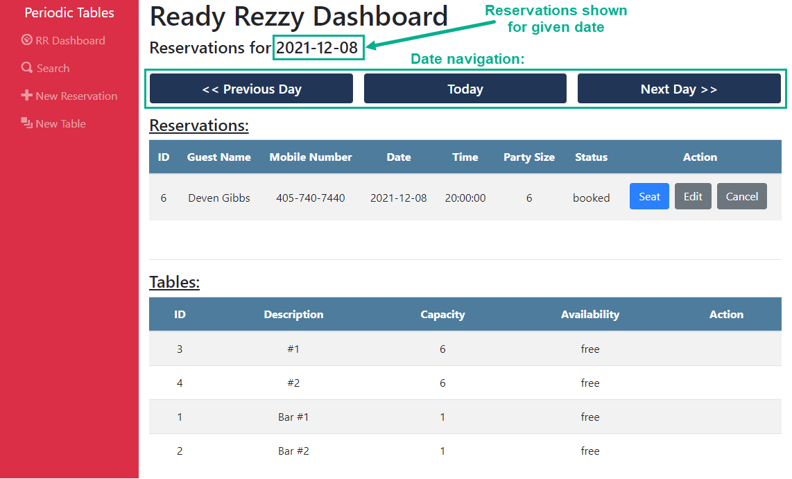
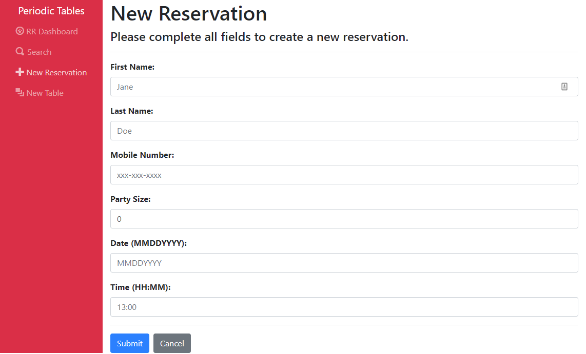
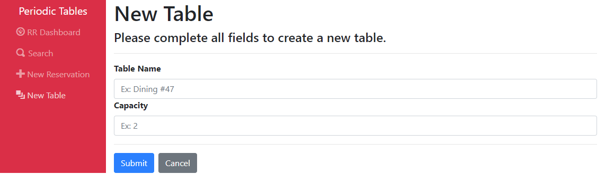
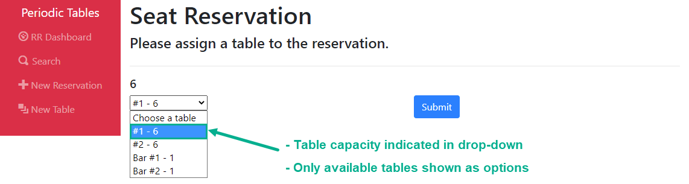
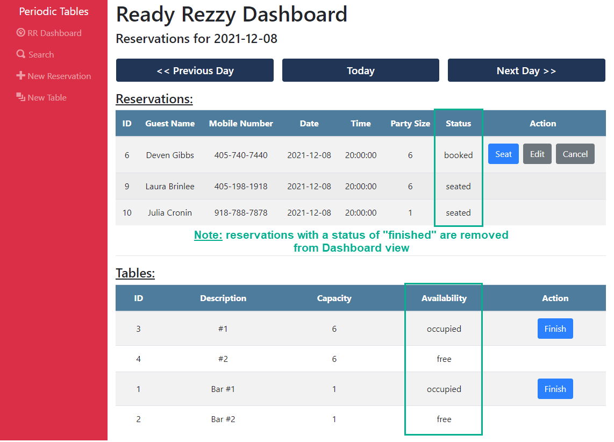
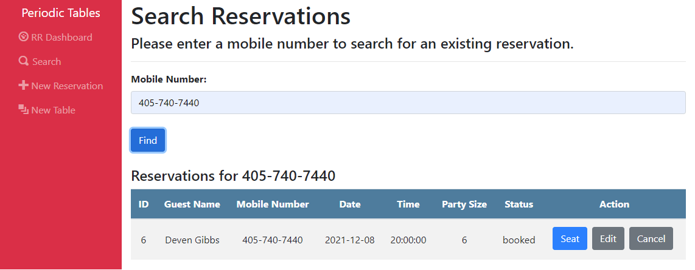

# Periodic Tables Presents: **Ready Rezzy** 
### A Simple, Easy-to-Use, Restaurant Reservation System

### *Also, my Thinkful Capstone Project*

## Try It Yourself:

[ReadyRezzy](https://dlg-reservations-front-end.herokuapp.com/dashboard)

Ready Rezzy is a restaurant reservation app built for restauranteurs to allow them to easily create, manage, and track both reservations and tables for their places of business. Restaurant personnel can use the system and information made available to them in this app to manage day-to-day operations and support customers when they call to inquire about reservations. 

## Key Features

### - **Easily access existing reservations and tables on the Dashboard.**

### - **Ability to create and store new reservations and tables.**
   - New Reservation:
   

   - New Table:
   

### - **Seat reservations at specific, available tables.**

### - **Seamlessly manage a reservation's status and/or table's availability throughout the course of business.**
   - Reservation Status: "booked", "seated" or "finished"
   - Table Availability: "free" or "occupied"

### - **Search for a reservation by the guest's phone number.**

## API Documentation

### **In alignment with REST best practices:**
 - `GET` requests return JSON responses.
 - `POST` and `PUT` requests require an application/JSON body and return a JSON response.

### **Endpoints for Reservations**

| API path                               | Method(s)                                                                                                        |
| -------------------------------------- | --------------------------------------------------------------------------------------------------------------- |
| `/reservations`                          | **GET**: List all reservations.  **POST**: Create a new reservation. |
| `/reservations/?date='YYYY-MM-DD'`       | **GET**: List all reservations by date. |
| `/reservations/:reservation_id`          | **GET**: Read a single reservation by 'reservation_id'.  **PUT**: Update a reservation by 'reservation_id'.  **DELETE**: Delete a reservation by 'reservation_id'. |
| `/reservations/:reservation_id/status`   | **PUT**: Update a reservation's status. Options being "booked", "seated", or "finished". |

### **Endpoints for Tables**

| API path                               | Method(s)                                                                                                        |
| -------------------------------------- | --------------------------------------------------------------------------------------------------------------- |
| `/tables`                          | **GET**: List all tables.  **POST**: Create a new table. |
| `/tables/:table_id`          | **GET**: Read a single table by 'table_id'.  **DELETE**: Delete a table by 'table_id'. |
| `/tables/:table_id/seat`   | **PUT**: Update a table's status to "occupied".  **DELETE**: Update a table's status to "free". |

## Technology Used

| Tier | Tool(s)                                                      
| ---------------- | ---------------------------------------------------------------- |
| front-end   | JavaScript, React, HTML, CSS, Bootstrap  |
| back-end    | JavaScript, Node.js, Express, Knex |
| database    | PostgreSQL |
| other       | Heroku, Github |

## Installation Instructions

1. Fork and clone this repository.
1. Run `cd .\back-end\` to navigate to the back-end folder structure
1. Run `cp .env.sample .env`
1. Copy and paste your database URLs into the back-end/.env file
1. Run `cd ../` to navigate back to the root folder structure
1. Run `npm install` to install project dependencies.
1. Run `npm run start` to start the application (back-end and front-end are run concurrently with this command).

## Special Thanks
* Thinkful, for the opportunity and support.
* My mentor, Lawrence Bautista, for his help and guidance throughout this project.

